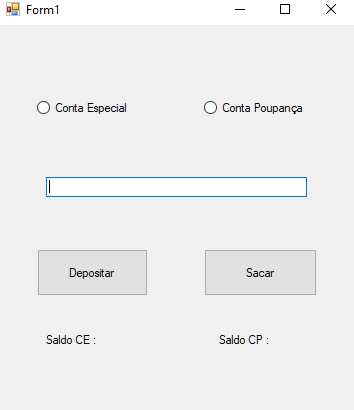
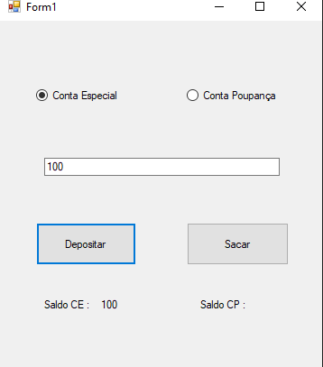
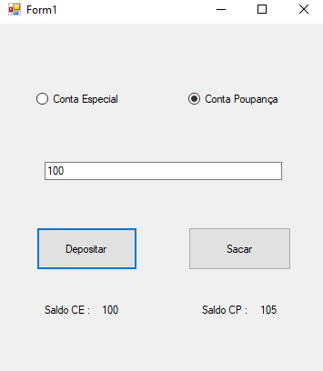
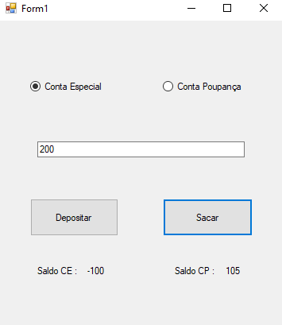
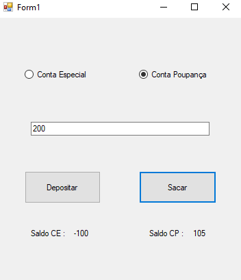

# poo_polimorfismo
Polimorfismo no C#
  

  <h3>Programa estilo bancco para entender o polimorfismo</h3>
  

  

  <h3>Parte do depósito. A conta poupança ganha um bônus pelo depósito</h3>
   

  

  <h3>Parte do saque. Se sacar demais da conta especial, vai ficar devendo. Porém, impossível sacar além do que tem na conta poupança</h3>
   

  
